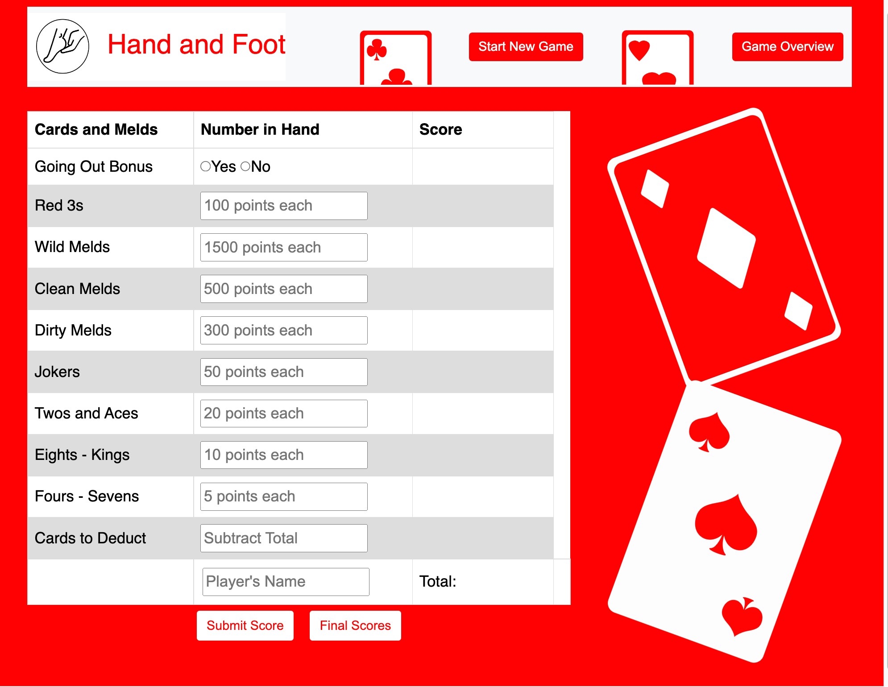
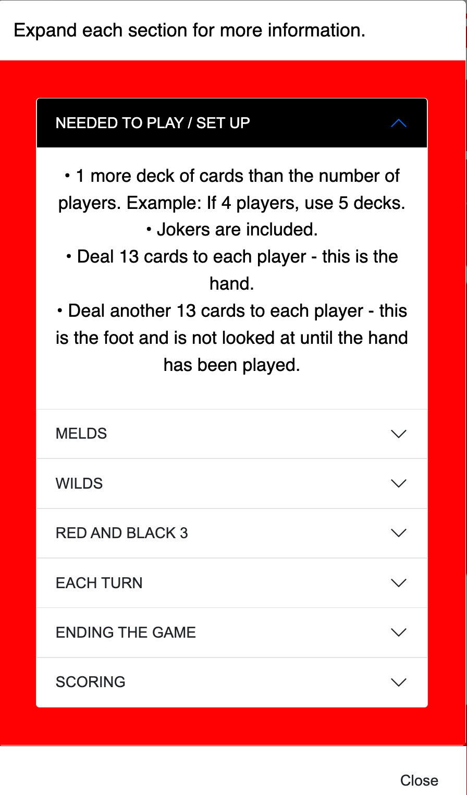

# Hand and Foot Score Keeper

## Table of Contents

- [Description](#description)
- [Technology](#technology)
- [Screenshots](#screenshots)
- [Demonstration](#demonstration)

## Description

This Hand and Foot Score Keeper contains all of the information someone needs to learn to play Hand and Foot and calculate scores at the end of the game.

The application is designed so the user can enter each player's name, cards played and any cards to be deducted to calculate each player's final score.  The Final Score button will display all the players' names and scores in the current game, sorted sorted from first place to last place.

The Start New Game button clears local storage of previously played games.  

Learn game requirements, set up, how to play and score Hand and Foot with the Game Overview button.

## Application
Click this link to view the application.....(coming soon)

## Technology

- JavaScript
- Local Storage
- Bootstrap

## Screenshots

## Demonstration

coming soon
