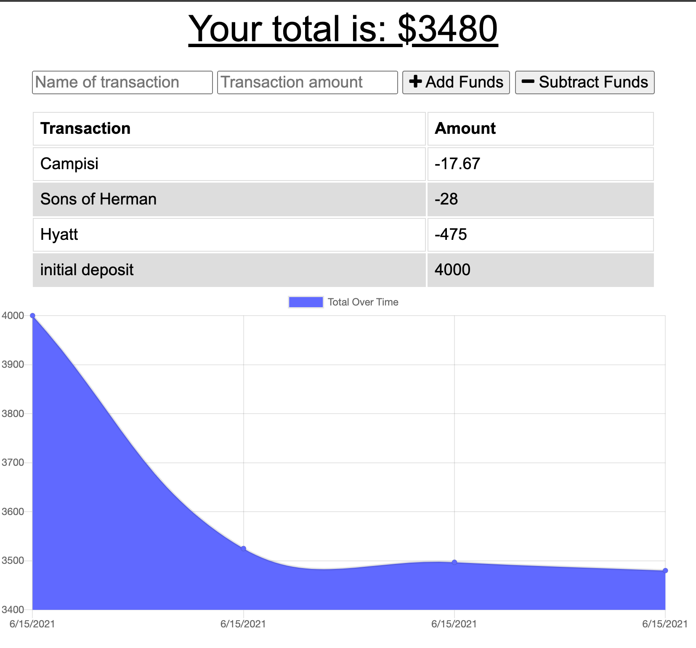

# Hand and Foot Score Keeper

## Table of Contents

- [Description](#description)
- [Technology](#technology)
- [Screenshots](#screenshots)
- [Demonstration](#demonstration)

## Description

This Hand and Foot Score Keeper App is a full stack application designed so the user can player names and the components to calculate the player's score.
When entering game information offline, the game will populate when brought back online.

### Click this link to view the deployed application (https://secure-hollows-27877.herokuapp.com/)

## Technology

- JavaScript
- Node.js
- Express.js
- MongoDB
- Mongoose ODM
- IndexedDB
- Webmanifest
- Progressive Web App

## Screenshots

## Demonstration

